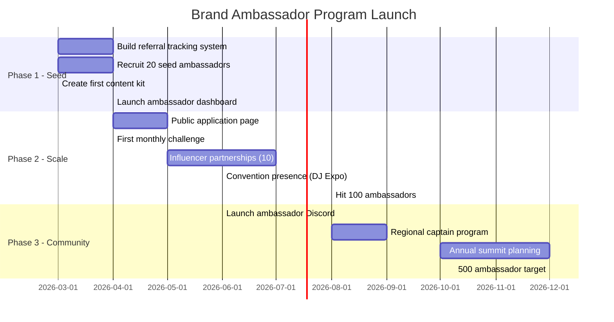

# GigLift Brand Ambassador Program
## Business Development Plan — February 2026

---

## Executive Summary

GigLift's Brand Ambassador Program turns our most engaged users — working DJs, bands, solo artists, and music instructors — into advocates who drive organic sign-ups in exchange for free product access, revenue share, and exclusive perks. Ambassadors promote GigLift within their local music scenes, online communities, and professional networks, creating a scalable, low-CAC growth engine.

---

## 1. Program Structure

### Ambassador Tiers

| Tier | Requirements | Monthly Compensation | Perks |
|---|---|---|---|
| **🥉 Starter** | 3+ referral sign-ups | Free Pro plan ($19/mo value) | Custom referral link, ambassador badge on EPK |
| **🥈 Rising** | 10+ referral sign-ups, 1 social post/week | Free Unlimited plan ($39/mo) + $5/referral who upgrades to paid | Early feature access, co-branded social content |
| **🥇 Elite** | 25+ referral sign-ups, 2 posts/week, 1 event/quarter | Free Unlimited + $10/referral upgrade + 15% rev share on referred subs | Featured on landing page, speaker at GigLift events, product advisory input |

### Ambassador Types

| Type | Profile | Primary Channels | Target |
|---|---|---|---|
| **Scene Leaders** | DJs/musicians with 1K+ local following | Instagram, TikTok, local Facebook groups | Performers in their metro area |
| **Music Educators** | Instructors with studio/school networks | Facebook groups, instructor forums, Wyzant/Lessonface | Music instructors |
| **Content Creators** | YouTube/TikTok music creators | YouTube tutorials, TikTok demos | Aspiring and working musicians nationwide |
| **Venue Insiders** | Bookers, promoters, venue managers | Direct referrals, industry events | Venues recommending GigLift to artists they work with |

---

## 2. Referral & Tracking System

### Technical Implementation

- **Custom referral links**: `giglift.vercel.app/sign-up?ref=AMBASSADOR_CODE`
- **Dashboard widget**: Ambassadors see real-time stats — sign-ups, conversions, earnings
- **Auto-attribution**: 90-day cookie tracks referred users through sign-up → paid conversion
- **Monthly payout**: Stripe Connect for automated revenue share disbursement

### Key Metrics per Ambassador

| Metric | Definition |
|---|---|
| **Referral Sign-ups** | Free accounts created via their link |
| **Conversion Rate** | % of sign-ups who upgrade to paid |
| **MRR Generated** | Monthly recurring revenue from their referrals |
| **Content Output** | Posts, stories, videos created per month |
| **Retention Rate** | % of referred users still active after 90 days |

---

## 3. Recruitment Strategy

### Phase 1: Seed Ambassadors (Month 1-2) — Target: 20 ambassadors

- **Internal outreach**: Identify top 50 most active GigLift users by scan count, leads generated, and outreach emails sent
- **Direct message**: Personalized invite via email highlighting their usage stats
- **Local music communities**: Post in DJ forums (r/DJs, r/mobileDJ, DJ TechTools), music instructor Facebook groups, local musician Slack/Discord channels
- **Music schools**: Partner with 5 music schools to offer GigLift free to graduating students, with instructor as ambassador

### Phase 2: Scale (Month 3-6) — Target: 100 ambassadors

- **Ambassador landing page**: Public application form on giglift.vercel.app/ambassadors
- **Referral chain**: Existing ambassadors recruit new ambassadors (bonus $25 per recruited ambassador who stays active 30 days)
- **Convention presence**: Attend DJ Expo, NAMM, local music meetups with ambassador sign-up stations
- **Influencer outreach**: Identify 10 music YouTubers with 10K-100K subs for paid partnerships → convert to ongoing ambassadors

### Phase 3: Community (Month 6-12) — Target: 500 ambassadors

- **Ambassador Slack/Discord**: Private community for knowledge sharing, content ideas, success stories
- **Regional captains**: Top ambassador per metro area gets $500/mo stipend + "GigLift Captain" title
- **Annual ambassador summit**: Virtual or in-person event with product roadmap previews, networking, awards

---

## 4. Content Playbook for Ambassadors

### Provided Assets (Monthly Kit)

Each month, ambassadors receive a content kit with:

- **3 social post templates** (carousel, story, reel scripts) — customizable with their branding
- **1 demo video script** — "How I found 50 leads in 10 minutes with GigLift"
- **Branded graphics** — Story stickers, post backgrounds, before/after comparisons
- **Talking points** — Key features to highlight that month (e.g., Instructor Mode launch)

### Content Themes by Week

| Week | Theme | Example Post |
|---|---|---|
| **1** | Lead Discovery | "Just found 47 new venues in my area with one click 🔍" |
| **2** | Outreach Results | "Sent 15 booking emails in 5 minutes — got 3 replies already ✉️" |
| **3** | Mode Switcher | "Instructor Mode just found me 12 schools looking for music instructors 📚" |
| **4** | Social Proof | "Booked 2 gigs this month from GigLift leads — here's how 🎵" |

### Platform-Specific Strategy

| Platform | Format | Frequency | Best For |
|---|---|---|---|
| **Instagram** | Reels, Stories, Carousels | 3x/week | Visual demos, before/after |
| **TikTok** | Short-form video | 2x/week | "Watch me find 50 leads" demos |
| **YouTube** | Tutorials, reviews | 2x/month | Deep-dive walkthroughs |
| **Facebook Groups** | Text posts, testimonials | 3x/week | Music instructor communities |
| **Reddit** | Value-add comments | As needed | r/DJs, r/WeAreTheMusicMakers |

---

## 5. Incentive & Gamification

### Monthly Challenges

| Challenge | Prize |
|---|---|
| **Most sign-ups** (top 3) | $100, $50, $25 gift cards |
| **Best content** (community vote) | Featured on GigLift homepage for 1 month |
| **First to 50 referrals** | Custom GigLift merch box (hoodie, stickers, USB drive) |
| **Best conversion rate** | 1-on-1 product strategy call with founding team |

### Milestone Rewards

| Milestone | Reward |
|---|---|
| **10 sign-ups** | GigLift sticker pack + shoutout on socials |
| **25 sign-ups** | GigLift t-shirt + priority support |
| **50 sign-ups** | GigLift hoodie + lifetime Pro access |
| **100 sign-ups** | Custom merch bundle + equity pool eligibility + advisory seat |

---

## 6. Budget Projection (Year 1)

| Item | Monthly Cost | Annual Cost |
|---|---|---|
| Free Pro/Unlimited plans (100 ambassadors) | $2,900 (opportunity cost) | $34,800 |
| Referral payouts ($7.50 avg per paid conversion) | $1,500 | $18,000 |
| Content kits & design | $500 | $6,000 |
| Monthly challenge prizes | $200 | $2,400 |
| Merch & milestone rewards | $300 | $3,600 |
| Convention/event presence | $400 | $4,800 |
| Ambassador community tools | $100 | $1,200 |
| **Total** | **$5,900** | **$70,800** |

### ROI Projection

| Metric | Conservative | Moderate | Aggressive |
|---|---|---|---|
| Ambassadors (Year 1) | 50 | 150 | 500 |
| Avg referrals per ambassador | 8 | 15 | 25 |
| Total referred sign-ups | 400 | 2,250 | 12,500 |
| Paid conversion rate | 10% | 15% | 20% |
| New paying users | 40 | 338 | 2,500 |
| Avg MRR per user | $22 | $22 | $22 |
| **Annual revenue from program** | **$10,560** | **$89,232** | **$660,000** |
| **ROI** | **-85%** | **+26%** | **+833%** |

---

## 7. Launch Timeline

---

## 8. Success Criteria

### 90-Day Goals
- [ ] 20 active ambassadors recruited
- [ ] 200+ referred sign-ups
- [ ] 20+ paid conversions from referrals
- [ ] Ambassador content generating 10K+ impressions/month

### 6-Month Goals
- [ ] 100 active ambassadors across 15+ metro areas
- [ ] 1,500+ referred sign-ups
- [ ] 150+ paid conversions
- [ ] Ambassador-driven MRR exceeds program costs (breakeven)

### 12-Month Goals
- [ ] 300+ active ambassadors
- [ ] 5,000+ referred sign-ups
- [ ] 500+ paid conversions
- [ ] Program ROI positive at 2x+ return
- [ ] Ambassador community self-sustaining with regional captains

---

## 9. Risk Mitigation

| Risk | Mitigation |
|---|---|
| **Low ambassador engagement** | Minimum activity thresholds per tier; inactive ambassadors downgraded after 30 days |
| **Brand misrepresentation** | Ambassador agreement with brand guidelines; content review for Elite tier |
| **Gaming referrals** | Require verified email; 14-day hold before counting referral; flag suspicious patterns |
| **High payout costs** | Cap monthly payouts at $500/ambassador; adjust rates quarterly based on LTV data |
| **Legal/compliance** | FTC disclosure requirements in ambassador agreement; #ad or #partner tags required |

---

## 10. Next Steps

1. **Build referral tracking** — Add `?ref=` param handling to sign-up flow, store in user metadata
2. **Create ambassador landing page** — `/ambassadors` with application form and program details
3. **Draft ambassador agreement** — Terms, brand guidelines, FTC compliance, payout schedule
4. **Design first content kit** — March 2026 social templates, demo video script
5. **Identify seed candidates** — Pull top 50 users by activity from admin dashboard
6. **Set up Stripe Connect** — For automated ambassador payouts
