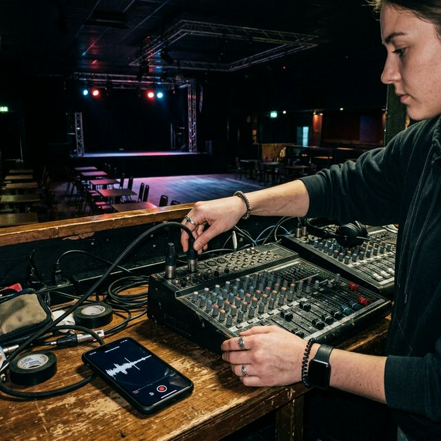

# GigLift AI Manager: Beta Launch Program

This program is designed to onboard initial power users into the Voice-Activated AI Manager features we just built, gather qualitative feedback, and drive viral early adoption.

---

## 🚀 The Beta Program Strategy

### Objective
Onboard 100 highly active DJs, producers, and gig workers to test and refine the AI Manager features (Invoicing, Logistics, Music Prep) before a fully public premium rollout.

### Target Audience
- Existing GigLift users who have scanned for leads at least 3 times in the last month.
- Frequent performers (2+ gigs a week).
- DJs heavily reliant on their phones for business operations.

### Exclusive Benefits for Beta Testers
1. **Free Lifetime Access:** They will never pay the premium rate for the AI Manager.
2. **Direct Feedback Loop:** A private Discord/Slack channel with the GigLift dev team to influence future AI capabilities.
3. **Priority Support:** Instant resolution on any booking or EPK issues.

### Duration
- **Launch Date:** Next Tuesday
- **Feedback Collection:** Weeks 2 and 4 (via short typeform/Typeform surveys)
- **Public Launch:** 6 weeks after Beta launch.

---

## 📧 Email Marketing Campaigns

### Email 1: The Exclusive Invitation (Send to Top Active Users)
**Subject:** 🤫 You're invited: Meet your new Executive Assistant (GigLift Beta)

**Body:**
Hey [Name],

We’ve noticed you’ve been crushing it with GigLift lately. You’re exactly the type of power user we wanted to reach out to for something special.

We just finished building the entirely new **Voice-Activated AI Manager**. It fundamentally changes how you run your DJ business. Instead of manually checking invoices, digging up load-in instructions, or drafting emails—you just tap a microphone and ask.

* "Did Tilly's pay their 20% deposit yet?"
* "What time do I need to leave for the gig tonight based on traffic?"
* "Ask the Social Hype Crew what tracks are trending on TikTok right now."

We’re opening up a private Beta for precisely 100 power users. 

**[Claim Your Beta Spot Here]**

If you get in, you'll get lifetime free access to the AI Manager. All we ask is that you break it, test it, and tell us exactly what you want it to do next.

Let's get you booked,
The GigLift Team

### Email 2: The Final Warning (Send 3 Days Later to Non-Openers/Clickers)
**Subject:** Only 14 spots left for the AI Manager Beta ⏳

**Body:**
Hey [Name],

Our AI Manager Beta filled up much faster than we anticipated, but we are holding a few of the last 14 spots specifically for our top-tier performers.

By joining the Beta, your phone instantly becomes an executive assistant capable of analyzing your financials, organizing your gig logistics, and interacting with your clients entirely via voice.

**[Secure Your Spot Before It Closes]**

Don't miss out on lifetime free access. We're locking the doors on Friday at midnight.

Cheers,
The GigLift Team

---

## 📱 Social Media Promotional Materials

### Instagram Post Graphic: "The Reveal"

**Caption:** A new era for DJs. Stop manually invoicing and typing emails. The GigLift Voice AI Manager Beta is open. 🎙️ Request early access at the link in our bio. #GigLiftBeta #DJTech #AgenticAI

### Instagram/TikTok Graphic: "The Setup Routine Concept"

**Caption:** Turn your smartphone into your booking agent. Instantly check deposits, get load-in info, and pull TikTok trending tracks with the tap of a button. 📱 Join the exclusive AI Manager Beta now before slots fill up. 

### Instagram/TikTok Graphic: "The Flex Concept"

**Caption:** "How much revenue has my touring mode booked this month?" 💸 Managing a mult-city tour by voice. The future is here with the GigLift Voice AI. Join the Beta today.

---

## 🖥️ Landing Page Copy (giglift.com/beta)

**Hero Headline:** Run Your Gig Business With Your Voice.
**Sub-headline:** The GigLift AI Manager handles your invoicing, gig logistics, and client emails while you focus on the setlist. Join the exclusive private Beta for lifetime access.
**Call to Action Button:** Request Early Access (Spots Limited)

**Value Proposition Grid:**
- **Financial Command:** Check deposits and forecast revenue without ever opening a spreadsheet.
- **Flawless Logistics:** Get instant traffic-adjusted departure times and private venue load-in instructions.
- **Smart Communication:** Stop stressing over what to say. Tell the AI your hourly rate, and it drafts the perfect client response.
